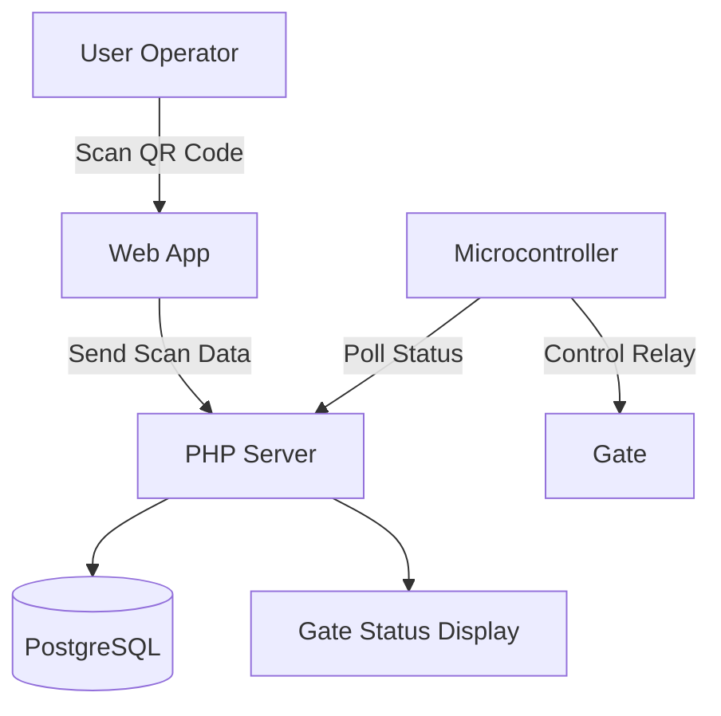

# IoT Gate Control System (HTTP Polling)

A simple, stable, and offline-capable **IoT Gate Control System** using ESP microcontrollers with **HTTP polling**, a **PHP backend**, and **PostgreSQL** database.

This project is designed as a **v1 implementation** that prioritizes simplicity, debuggability, and reliability on networks (WIFI), with a clear upgrade path to real-time protocols such as MQTT.

---

## 🎯 Project Goals

- Control a physical gate using microcontrollers and relay
- Validate access based on scan logic (e.g. 2 valid scans required)
- Operate reliably on a **local / offline network**
- Keep the system simple and easy to debug
- Provide a clear system architecture for future upgrades

---

## 🚀 Features

- ✅ HTTP polling-based gate control
- ✅ Supports ESP32, ESP8266, and Arduino + LAN
- ✅ Offline-first (no internet required)
- ✅ PHP backend 
- ✅ PostgreSQL database
- ✅ Scan validation logic on server side
- ✅ Relay control for physical gate

---

## 🏗️ System Architecture

### Architecture



---

## 🧠 How It Works

1. User performs a **scan** via web application
2. PHP validates and updates scan count in the database
3. Microcontroller polls `gate_status.php` at a fixed interval
4. If scan conditions are met:
   - Gate status becomes `OPEN`
   - Relay is activated
5. Gate status is reset after execution
6. Status display page reflects gate state automatically

---
## 🏗️ Flow Proccess
```mermaid
flowchart TD
    A["Crew transfer ambil barang dari area picking"]
    B["Barang ditempatkan di handpallet / pallet mover"]
    C["Scan barcode barang"]
    D{Scan valid di WMS?}
    E["Update stok in-transit & cetak label WHL"]
    F["ESP8266 polling status scan valid"]
    G{Status valid diterima ESP?}
    H["Relay aktif - gate terbuka"]
    I["Barang melewati gate menggunakan handpallet / pallet mover"]
    J["Gate menutup otomatis"]
    K["Barang dikirim ke WHL"]
    L["Scan gagal / tidak valid"]
    M["Gate tetap tertutup - barang tidak bisa keluar"]

    A --> B
    B --> C
    C --> D

    D -- Ya --> E
    E --> F
    F --> G
    G -- Ya --> H
    H --> I
    I --> J
    J --> K

    D -- Tidak --> L
    L --> M


---


